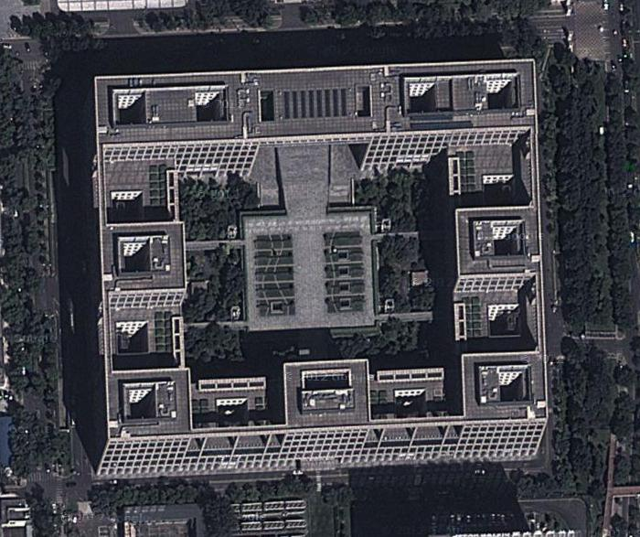

# General-Binary-Channel-Simulation

## Project Summary
This is to simulate using Matlab programming a remote sensing image through a general binary channel.

The output image with the bit error rate parameters of p and q.

* p varying from 0 to 1 with 0.1 step (including p=0, p=1).
* q varying from 0 to 1 with 0.1 step (including q=0, q=1).

## Run in MATLAB

* general_binary_channel.m is a function that recives image in the form of real valued matrix and returns it after the general binary channel according to the  probability of p and q.

* main.m is a script which reads remote sensing image and uses general_binary_channel.m to simulate after the binary channel.
 It displays all the possible images result for each p and q separately,

## Input image 

* remote_sensing_image.jpg.

## Output image

* output image for remote_sensing_image when p=0.7 and q=0 to 1.

